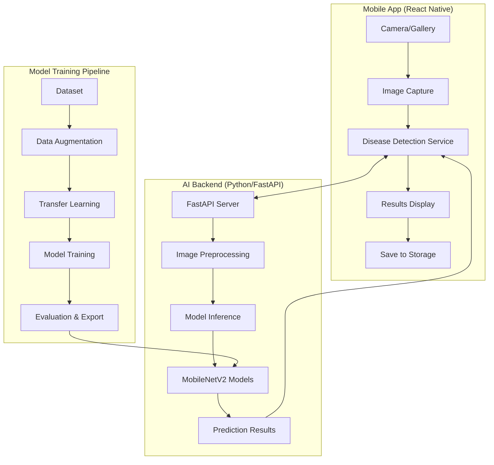

# 🌾 VerdScan - AI-Powered Crop Disease Detection

<div align="center">


**Empowering farmers with AI-driven crop health monitoring**

[](https://reactnative.dev/)
[](https://www.python.org/)
[](https://tensorflow.org/)
[](https://fastapi.tiangolo.com/)
[](LICENSE)

[Features](#-features) •
[Quick Start](#-quick-start) •
[Architecture](#-architecture) •
[Installation](#-installation) •
[Documentation](#-documentation) •
[Contributing](#-contributing)

</div>

---

## 🎯 Overview

VerdScan is a comprehensive AI-powered mobile application that helps farmers and agricultural professionals detect diseases in crop leaves using computer vision and deep learning. The system combines a React Native mobile app with a Python-based AI backend to provide real-time crop health analysis.

### Supported Crops & Diseases

| Crop | Diseases Detected | Accuracy |
|------|------------------|----------|
| **🌿 Cassava** | Bacterial Blight, Brown Streak Disease, Green Mottle, Mosaic Disease + Healthy | ~83% |
| **🌽 Maize** | Blight, Common Rust, Gray Leaf Spot + Healthy | ~95% |
| **🍅 Tomato** | 9 disease types including Early Blight, Late Blight, Leaf Mold + Healthy | ~95% |

## ✨ Features

### 📱 Mobile App (React Native)
- **📸 Camera Integration**: Capture or select leaf images
- **🔍 Real-time Disease Detection**: Instant AI-powered analysis
- **📊 Detailed Results**: Confidence scores and disease information
- **💾 Save & History**: Store results for future reference
- **🎓 Educational Content**: Disease information and treatment recommendations
- **🌙 Dark/Light Mode**: Adaptive UI design
- **📱 Cross-platform**: iOS and Android support

### 🤖 AI Backend (Python/FastAPI)
- **🧠 Deep Learning Models**: MobileNetV2-based transfer learning
- **⚡ Fast Inference**: Optimized for real-time predictions
- **🌐 RESTful API**: Easy integration and scalability
- **🔄 Multi-crop Support**: Simultaneous handling of multiple crop types
- **📈 Model Management**: Hot-swappable trained models
- **🛡️ CORS Enabled**: Ready for web and mobile integration

### 🔬 Model Training Pipeline
- **📊 Data Augmentation**: Robust training with image transformations
- **🏋️ Transfer Learning**: Leverage pre-trained ImageNet weights
- **📈 Model Evaluation**: Comprehensive metrics and visualizations
- **🔧 Custom Training**: Support for your own datasets
- **💾 Model Versioning**: Track and manage different model versions

## 🚀 Quick Start

### Prerequisites
- **Node.js** 18+ and npm/yarn
- **Python** 3.8+ with pip
- **Expo CLI** for mobile development
- **Git** for version control

### 1. Clone Repository
```bash
git clone https://github.com/your-username/verdiscan.git
cd verdiscan
```

### 2. Setup AI Backend
```bash
# Install Python dependencies
cd model
pip install -r requirements.txt

# Start the API server
cd api
python main.py
```
The API will be available at `http://localhost:8000`

### 3. Setup Mobile App
```bash
# Install dependencies
cd mobileApp
npm install

# Start development server
npx expo start
```

### 4. Configure Connection
Update `mobileApp/config/api.ts`:
```typescript
export const API_CONFIG = {
  USE_MOCK_SERVICE: false,
  API_BASE_URL: 'http://localhost:8000', // Your API server URL
};
```

### 5. Test the App
- Open Expo Go app on your device
- Scan the QR code from Expo CLI
- Take a photo of a crop leaf and get instant disease detection!

## 🏗️ Architecture



### Component Overview

| Component | Technology | Purpose |
|-----------|------------|---------|
| **Mobile App** | React Native + Expo | User interface and camera integration |
| **AI API** | FastAPI + TensorFlow | Disease detection inference |
| **Models** | MobileNetV2 + Transfer Learning | Deep learning for image classification |
| **Training** | Python + TensorFlow | Model development and evaluation |

## 📦 Installation

### Option 1: Quick Setup (Recommended)

```bash
# Clone and setup everything
git clone https://github.com/your-username/verdiscan.git
cd verdiscan

# Setup backend
cd model && pip install -r requirements.txt
python api/main.py &

# Setup mobile app
cd ../mobileApp && npm install
npx expo start
```

### Option 2: Step-by-Step Setup

#### Backend Setup
```bash
cd model

# Option A: Use installation scripts
./install_requirements.sh        # Linux/Mac
install_requirements.bat         # Windows

# Option B: Manual installation
pip install -r requirements.txt
```

#### Mobile App Setup
```bash
cd mobileApp

# Install dependencies
npm install

# Start development server
npx expo start

# Run on specific platforms
npx expo start --android
npx expo start --ios
```

### Option 3: Docker Setup (Coming Soon)

```bash
# Build and run with Docker Compose
docker-compose up --build
```

## 📚 Documentation

### 📖 Comprehensive Guides

| Guide | Description | Location |
|-------|-------------|----------|
| **[API Setup Guide](API_SETUP_GUIDE.md)** | Complete backend setup after cloning | `/API_SETUP_GUIDE.md` |
| **[Model Training Guide](MODEL_TRAINING_GUIDE.md)** | Train your own disease detection models | `/MODEL_TRAINING_GUIDE.md` |
| **[API Documentation](model/api/README.md)** | FastAPI endpoints and usage | `/model/api/README.md` |
| **[Installation Guide](model/INSTALL.md)** | Detailed dependency setup | `/model/INSTALL.md` |

### 🛠️ API Reference

#### Base URL
```
http://localhost:8000
```

#### Key Endpoints
```bash
GET  /health                    # Health check
POST /detect/cassava           # Cassava disease detection
POST /detect/maize             # Maize disease detection  
POST /detect/tomato            # Tomato disease detection
POST /detect/auto              # Auto-detect crop type
```

#### Example Response
```json
{
  "crop_type": "tomato",
  "predicted_disease": "early_blight",
  "confidence": 0.94,
  "all_probabilities": {
    "early_blight": 0.94,
    "healthy": 0.03,
    "late_blight": 0.02,
    "leaf_mold": 0.01
  },
  "status": "diseased"
}
```

## 🧠 Model Training

### Train Your Own Models

```bash
# Interactive training
cd model
python train_model.py

# Command line training
python train_model.py --crop cassava --epochs 50

# Windows batch scripts
train_cassava.bat
train_maize.bat
train_tomato.bat
```

### Expected Performance

| Metric | Cassava | Maize | Tomato |
|--------|---------|-------|---------|
| **Accuracy** | 83% | 95% | 95% |
| **Classes** | 5 | 4 | 10 |
| **Training Time** | 1-4 hours | 1-3 hours | 2-6 hours |
| **Model Size** | ~27MB | ~27MB | ~27MB |

### Dataset Requirements

```
model/data/
├── cassava/
│   ├── bacterial_blight/     (100+ images)
│   ├── brown_streak_disease/ (100+ images)
│   ├── healthy/             (100+ images)
│   └── ...
├── maize/
│   ├── blight/              (100+ images)
│   ├── healthy/             (100+ images)
│   └── ...
└── tomato/
    ├── early_blight/        (100+ images)
    ├── healthy/             (100+ images)
    └── ...
```

## 🔧 Configuration

### Mobile App Configuration

Edit `mobileApp/config/api.ts`:

```typescript
export const API_CONFIG = {
  // Toggle between mock and real API
  USE_MOCK_SERVICE: false,
  
  // API server URL (update for your setup)
  API_BASE_URL: 'http://localhost:8000',
  
  // Alternative configurations
  // API_BASE_URL: 'http://192.168.1.100:8000', // Local network
  // API_BASE_URL: 'http://10.0.2.2:8000',      // Android emulator
  
  REQUEST_TIMEOUT: 30000,
  RETRY: {
    MAX_ATTEMPTS: 3,
    DELAY_MS: 1000,
  },
};
```

### Backend Configuration

The FastAPI server automatically configures:
- **CORS**: Enabled for all origins (restrict in production)
- **Model Loading**: Automatic detection of available models
- **Error Handling**: Comprehensive error responses
- **Logging**: Detailed request/response logging

## 🧪 Testing

### API Testing
```bash
# Automated API tests
cd model/api
python test_api.py

# Manual testing with curl
curl http://localhost:8000/health
curl -X POST "http://localhost:8000/detect/cassava" \
  -H "Content-Type: multipart/form-data" \
  -F "file=@leaf_image.jpg"
```

### Mobile App Testing
```bash
# Run on device/emulator
cd mobileApp
npx expo start --android
npx expo start --ios

# Test with Expo Go app
# Scan QR code and test camera functionality
```

### Model Evaluation
```bash
# Evaluate trained models
cd model/scripts
python mobilenet_evaluate.py --crop cassava
python mobilenet_evaluate.py --crop maize
python mobilenet_evaluate.py --crop tomato
```

## 📱 Mobile App Features

### Core Functionality
- **📸 Image Capture**: Camera and gallery integration
- **🔍 Disease Detection**: Real-time AI analysis
- **📊 Results Display**: Confidence scores and disease info
- **💾 History Management**: Save and review past scans
- **📚 Educational Content**: Disease information and treatments

### User Experience
- **🎨 Modern UI**: Clean, intuitive interface
- **🌙 Theme Support**: Light and dark modes
- **📱 Responsive**: Adapts to different screen sizes
- **⚡ Performance**: Optimized for smooth operation
- **🔄 Offline Support**: Basic functionality without internet

### Navigation Structure
```
App
├── Onboarding (First-time user setup)
├── Main App
│   ├── Home (Dashboard)
│   ├── Diagnose (Camera/Analysis)
│   ├── Saved Results (History)
│   └── Settings
└── Results (Disease information)
```

## 🌐 Deployment

### Development
```bash
# Local development
cd model/api && python main.py
cd mobileApp && npx expo start
```

### Production API
```bash
# Using Gunicorn (recommended)
pip install gunicorn
gunicorn main:app -w 4 -k uvicorn.workers.UvicornWorker --bind 0.0.0.0:8000

# Using Docker
docker build -t verdiscan-api .
docker run -p 8000:8000 verdiscan-api
```

### Mobile App Distribution
```bash
# Build for production
cd mobileApp
npx expo build:android
npx expo build:ios

# Or use EAS Build
npx eas build --platform android
npx eas build --platform ios
```

## 🛠️ Development

### Project Structure
```
verdiscan/
├── mobileApp/                 # React Native mobile app
│   ├── app/                   # App screens and navigation
│   ├── components/            # Reusable UI components
│   ├── services/              # API and business logic
│   ├── config/                # App configuration
│   └── assets/                # Images, fonts, etc.
├── model/                     # AI/ML backend
│   ├── api/                   # FastAPI server
│   ├── models/                # Trained model files
│   ├── scripts/               # Training and evaluation
│   └── data/                  # Training datasets
└── docs/                      # Documentation
```

### Tech Stack

#### Mobile App
- **Framework**: React Native with Expo
- **Navigation**: Expo Router
- **State Management**: React Hooks + AsyncStorage
- **UI Components**: Custom components with React Native
- **Camera**: Expo Image Picker
- **Networking**: Fetch API with retry logic

#### Backend
- **API Framework**: FastAPI
- **ML Framework**: TensorFlow 2.x
- **Image Processing**: PIL (Pillow)
- **Model Architecture**: MobileNetV2 with transfer learning
- **Server**: Uvicorn ASGI server

#### DevOps & Tools
- **Version Control**: Git
- **Package Management**: npm (mobile), pip (backend)
- **Code Quality**: ESLint, TypeScript
- **Testing**: Jest (planned), pytest (planned)

## 🤝 Contributing

We welcome contributions from the community! Here's how you can help:

### Ways to Contribute
- 🐛 **Bug Reports**: Report issues and bugs
- 💡 **Feature Requests**: Suggest new features
- 📝 **Documentation**: Improve docs and guides
- 🧪 **Testing**: Add tests and improve coverage
- 🤖 **Model Improvements**: Enhance AI models
- 🎨 **UI/UX**: Improve app design and usability

### Development Setup
1. Fork the repository
2. Create a feature branch: `git checkout -b feature-name`
3. Make your changes and test thoroughly
4. Commit with clear messages: `git commit -m "Add feature X"`
5. Push to your fork: `git push origin feature-name`
6. Create a Pull Request

### Coding Standards
- **Mobile App**: Follow React Native and TypeScript best practices
- **Backend**: Follow Python PEP 8 and FastAPI conventions
- **Documentation**: Update relevant docs with changes
- **Testing**: Add tests for new features

## 📊 Performance

### Model Performance
| Crop | Accuracy | Precision | Recall | F1-Score |
|------|----------|-----------|--------|----------|
| Cassava | 83% | 0.76 | 0.77 | 0.76 |
| Maize | 95% | 0.95 | 0.95 | 0.95 |
| Tomato | 95% | 0.94 | 0.95 | 0.94 |

### System Requirements

#### Minimum Requirements
- **Mobile**: iOS 11+ / Android 7+ with camera
- **Server**: 4GB RAM, 2 CPU cores, 10GB storage
- **Network**: Internet connection for API calls

#### Recommended Requirements
- **Mobile**: iOS 13+ / Android 9+ with good camera
- **Server**: 8GB RAM, 4 CPU cores, 20GB storage, GPU optional
- **Network**: Stable internet, WiFi preferred

## 🔒 Security & Privacy

### Data Privacy
- **Local Processing**: Images processed on-device when possible
- **No Data Storage**: Server doesn't permanently store user images
- **Anonymized Analytics**: Only aggregate usage statistics collected

### Security Measures
- **HTTPS**: Secure API communication (configure in production)
- **Input Validation**: Comprehensive request validation
- **Error Handling**: Safe error responses without sensitive info
- **Rate Limiting**: API rate limiting (implement in production)

## 🐛 Troubleshooting

### Common Issues

#### Mobile App
```bash
# Metro bundler issues
npx expo start --clear

# iOS simulator issues
npx expo start --ios --clear

# Android emulator issues
npx expo start --android --clear
```

#### API Server
```bash
# Port already in use
lsof -i :8000  # Find process
kill -9 <PID>  # Kill process

# Model loading issues
# Check model file paths in api/main.py
# Ensure models exist in correct directories
```

#### Training Issues
```bash
# Out of memory
# Reduce batch size in training scripts
# Use CPU instead of GPU if necessary

# Data not found
# Verify dataset structure matches requirements
# Check file paths and permissions
```

### Getting Help
- 📖 Check the [documentation](#-documentation)
- 🐛 Search [existing issues](https://github.com/your-username/verdiscan/issues)
- 💬 Create a [new issue](https://github.com/your-username/verdiscan/issues/new)
- 📧 Contact maintainers

## 📅 Roadmap

### Version 1.1 (Coming Soon)
- [ ] **Offline Mode**: Run models locally on device
- [ ] **Batch Processing**: Analyze multiple images at once
- [ ] **Treatment Recommendations**: Detailed treatment suggestions
- [ ] **Weather Integration**: Weather-based disease predictions

### Version 1.2 (Future)
- [ ] **More Crops**: Support for rice, wheat, and other crops
- [ ] **Disease Tracking**: Track disease progression over time
- [ ] **Community Features**: Share findings with other farmers
- [ ] **Expert Consultation**: Connect with agricultural experts

### Version 2.0 (Long-term)
- [ ] **IoT Integration**: Connect with field sensors
- [ ] **Drone Support**: Analyze aerial crop images
- [ ] **Predictive Analytics**: Forecast disease outbreaks
- [ ] **Multi-language**: Support for local languages

## 📄 License

This project is licensed under the MIT License - see the [LICENSE](LICENSE) file for details.

## 🙏 Acknowledgments

- **TensorFlow Team** for the excellent ML framework
- **Expo Team** for simplifying React Native development
- **FastAPI Team** for the high-performance web framework
- **Agricultural Research Community** for disease classification datasets
- **Open Source Community** for inspiration and contributions

## 📞 Support

- **Documentation**: Comprehensive guides in `/docs` folder
- **Issues**: Report bugs and request features on GitHub
- **Discussions**: Join community discussions
- **Email**: Contact maintainers directly

---

<div align="center">

**Built with ❤️ for farmers and agricultural communities worldwide**

[⭐ Star this project](https://github.com/your-username/verdiscan) if you find it useful!

</div>
